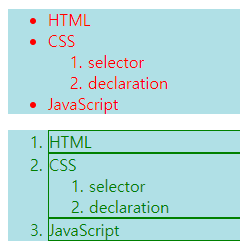

# 2가지 기본 사용법

1. 태그 선언
```html
<head>
  <style>
    h2{color:blue}
  </style>
</head>
<body>
  <h2>Hello world</h2>
</body>
```

2. 속성 선언
```html
<body>
  <h1 style="color:red">Hello World</h1>
</body>
```

# 선택자(selector)

선택자는 CSS에서 스타일을 적용할 HTML 요소를 선택하는 방법이다.

```html
<head>
  <style>
    li {                   <-- 선택자
      color:red;
      text-decoration:underline;
    }
  </style>
</head>
<body>
  <ul>
    <li>HTML</li>
    <li>CSS</li>
    <li>JavaScript</li>
  </ul>
</body>
```

# 태그 선택자

태그를 선택하여 스타일을 적용.

```html
<style>
  li{color:red;}     <--  li 태그 선택.
</style>
```

# 아이디 선택자

아이디 선택자는 ID 속성을 사용하여 특정 태그에만 스타일을 적용.

```html
<head>
<style>
  li{color:red;}
  #select{            <-- # 으로 시작. ID가 select인 태그에 효과 적용.
    font-size:50px;
  }
</style>
</head>
<body>
  <ul>
    <li>HTML</li>
    <li id="select">CSS</li>   <-- ID를 select로 지정 하였다.
    <li>JavaScript</li>
  </ul>
</body>
```

주의 사항
- 다음과 같이 여러 태그를 선택하여도 정상 동작 하지만 지양해야 한다.
- ID는 고유성이라는 성질을 가지며 ID 선택자의 원래 목적은 하나만 지정 하는 것이다.
- 여러 태그를 선택하려면 클래스 선택자를 사용 해야 한다.

```html
<li id="deactive">HTML</li>
<li id="deactive">JavaScript</li>
```
       


# 클래스 선택자

class 속성을 사용하여 특정 태그들에 스타일을 적용.

```html
<head>
<style>
  .deactive{             <-- . 으로 시작. 클래스가 deactive인 태그에 효과 적용.
    text-decoration: line-through;
  }
</style>
</head>
<body>
<ul>
    <li class="deactive">HTML</li>
    <li class="deactive">JavaScript</li>
</ul>
</body>
```

클래스 선택자는 태그 선택자와 조합하여 사용 가능 하다.
- `li.deactive`

# 링크 관련 선택자
- `:link` : 방문한 적이 없는 링크 태그
- `:visited1` : 방문한 적이 있는 링크 태그
- `:hover` : 마우스 롤오버된 태그
- `:active` : 마우스 클릭된 태그
- hover 와 active 가 같이 선언 되었을 경우 맨 마지막 선언이 적용

```html
<head>
  <style>
    a.hover{
      color:yellow;
    }
    a.active{
      coror:green;
    }
  </style>
</head>
<body>
  <ul>
    <a href=""></a>
    <a href=""></a>
  </ul>
</body>
```

# 선택자 조합

부모와 자손 관계
```html
ul li{
    color:red;
}
```
- 웹페이지에 있는 모든 ul 밑에 있는 li 태그에 적용
- 하위 태그를 지정하는 법은 띄어쓰기이다.

부모와 자식 관계
```html
#lecture>li{
    border:1px solid red;
}
```
- `#lecture` 바로 밑에 있는 li 에만 적용 한다.
- 주의! 모든 속성이 위와 같이 적용 되는것은 아니다. color 라는 속성은 하위 요소들 모두에 영향을 주기에 의미가 없다.

형제 관계
```html
ul,ol{
    background-color: powderblue;
}
```
- ul 와 ol 태그를 둘다 선택 한다.


```html
<head>
    <style>
        ul li{
            color:red;
        }
        #lecture>li{
            border:1px solid green;
            color:green;
        }
        ul,ol{
            background-color: powderblue;
        }
    </style>
</head>
<body>
<ul>                            //ul,ol 적용 O
    <li>HTML</li>               //ul li 적용 O
    <li>CSS                     //ul li 적용 O
        <ol>
            <li>selector</li>       //ul li 적용 O
            <li>declaration</li>    //ul li 적용 O
        </ol>
    </li>
    <li>JavaScript</li>         //ul li 적용
</ul>
<ol id="lecture">               //ul,ol 적용 O
    <li>HTML</li>               //#lecture>li 적용 O
    <li>CSS                     //#lecture>li 적용 O
        <ol>
            <li>selector</li>       //#lecture>li 적용 X
            <li>declaration</li>    //#lecture>li 적용 X
        </ol>
    </li>
    <li>JavaScript</li>         //#lecture>li 적용 O
</ol>
</body>
```
- 
